#Task

*This room is inspired from real-life vulnerabilities and misconfigurations* *I encountered during security assessments.*

*If you get stuck at some point, take some time to keep enumerating.*

*
*

**[ Your Mission ]**

You have been contracted by UltraTech to pentest their infrastructure.

It is a grey-box kind of assessment, the only information you have

is the company's name and their server's IP address.

**Start this room by hitting the "deploy" button on the right!**

Good luck and more importantly, have fun!

#Enumeration

We start with a normal nmap scan for all ports and service to answer the first several questions

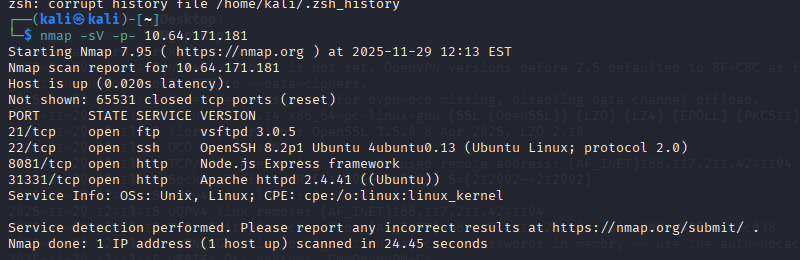

Now we are able to answer the questions about services and ports.

Next, we use a nmap scan with -O to scan for the Linux distribution.

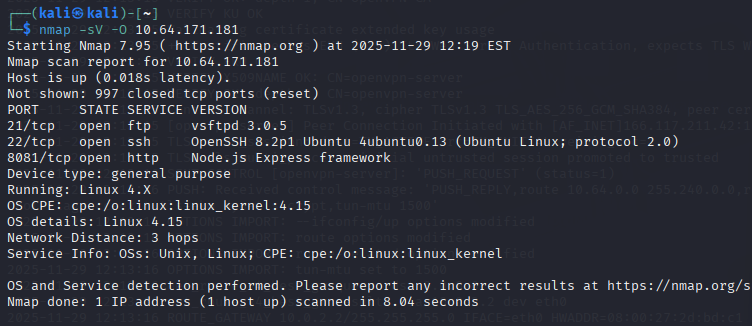

Next, we need to figure out the number of routes under REST api.

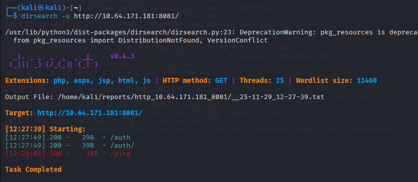

We do a dirsearch to find all the routes.

#Exploit

We noticed that ftp port 21 is opened, which means we can try the ftp anonymous login.

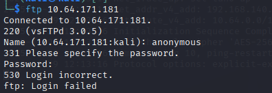

However, we can not.

According to the hint, let's focus on how api is called.

Let's use ffuf to fuzz the routes with common wordlists.

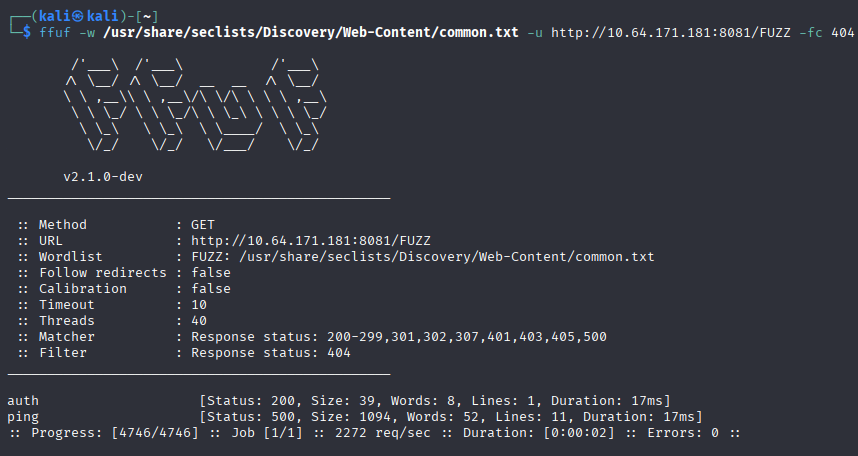

We find an interesting point here.

Ping is look like not filter.

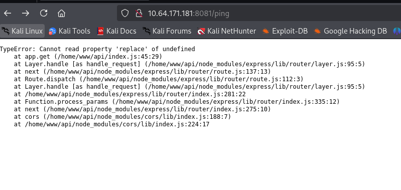

We are correct. Ping is not filtered.

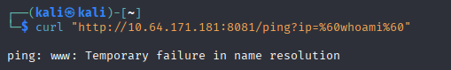

Success. It returned www(www-data).

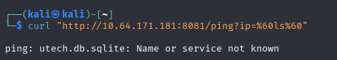

utech.db.sqlite is returned.

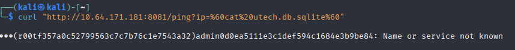

We directly cat the target database, and looks like it returned two hash.

We need to crack the hash.

root:

 n100906

admin:

 mrsheafy

Now we have two credentials.

#Escalation privilege

I remembered ftp is opened, let's check for ssh.

After login as r00t, let's check our current status.

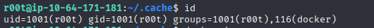

We are user r00t, however, there may exist docker.

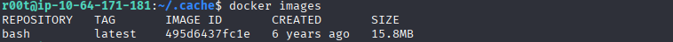

Correct, there is a docker images.

We can try to escalation privilege through this.

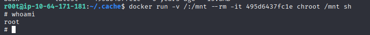

We are root now.

We only need to use cat to view the ssh private key.

Thanks for reading!

